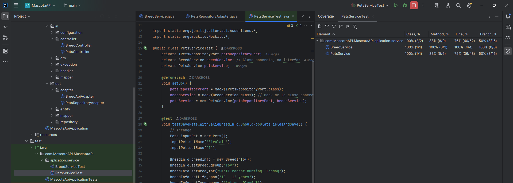

# 🐾 Mascota API - Prueba Técnica Backend

Este proyecto es una **API REST desarrollada con Spring Boot** que permite el registro y consulta de mascotas. Durante el registro, el sistema **enriquece los datos con información proveniente de una API externa** de razas caninas. La arquitectura está basada en el patrón **hexagonal (puertos y adaptadores)**.

---

## 📌 Descripción del ejercicio

El objetivo del sistema es exponer dos endpoints REST:

### 1. Registro de Mascotas

Permite registrar una mascota con los siguientes campos:
- Nombre
- Edad
- Dirección
- Ciudad
- Raza

Al registrar, se consulta una API externa según la raza para completar automáticamente:
- `life_span`
- `weight`
- `height`
- `breed_group`
- `temperament`
- `bred_for`

Estos datos se almacenan junto a la mascota en una base de datos **PostgreSQL**.

---

### 2. Consulta de Mascotas

Permite consultar mascotas registradas usando filtros por:
- Grupo de raza
- Raza
- Rango de edad
- Rango de peso
- Rango de altura

> Los filtros fueron implementados usando **consultas JPQL personalizadas**, no `Specification`.

---

## ✅ Solución técnica

- **Java 17**
- **Spring Boot 3**
- **Arquitectura Hexagonal**
- **Persistencia con PostgreSQL y Spring Data JPA**
- **Consumo de API externa con `RestTemplate`**
- **Consultas con filtros usando JPQL**
- **Manejo de logs con SLF4J utilizando LoggerFactory**
- **Pruebas unitarias con JUnit 5 y Mockito**
- **Contenerización con Docker y Docker Compose**

---

## 🧪 Cobertura de código



> Cobertura generada usando **JaCoCo** y reportada como parte del proceso de pruebas.

---

## 🗃️ Esquema de base de datos

### 🐶 Estructura de la tabla `tbl_reg_pets`:

| Columna        | Tipo SQL         | Descripción                                          |
|----------------|------------------|------------------------------------------------------|
| id_pets        | BIGINT           | Identificador autogenerado (PK)                     |
| name           | VARCHAR          | Nombre de la mascota                                |
| age            | INTEGER          | Edad actual de la mascota                           |
| address        | VARCHAR          | Dirección del propietario                           |
| city           | VARCHAR          | Ciudad del propietario                              |
| race           | VARCHAR          | Raza ingresada                                      |
| age_min        | INTEGER          | Edad mínima de vida de la raza (desde API externa)  |
| age_max        | INTEGER          | Edad máxima de vida de la raza (desde API externa)  |
| weight_min     | DOUBLE  | Peso mínimo de la raza (desde API externa)          |
| weight_max     | DOUBLE  | Peso máximo de la raza (desde API externa)          |
| height_min     | DOUBLE  | Altura mínima de la raza (desde API externa)        |
| height_max     | DOUBLE  | Altura máxima de la raza (desde API externa)        |
| race_group     | VARCHAR          | Grupo de raza (desde API externa)                   |
| temper         | VARCHAR          | Temperamento de la raza (desde API externa)         |
| purpose_race   | VARCHAR          | Propósito de la raza (bred_for desde API externa)   |

---

## 🌐 Consumo del API externa

La API externa es consultada usando **`RestTemplate`**, dentro del adaptador correspondiente (`BreedApiAdapter`). Se hace una búsqueda por nombre de raza y se mapea la información de la respuesta para complementar los datos del registro.

> No se implementó cache para el consumo del API.

---

### 📬 Colección de Postman

Puedes importar y probar las APIs con la siguiente colección de Postman:

[📥 Descargar colección Postman](./PetsApi.postman_collection.json)

## 🚀 Cómo levantar el proyecto

### 1. Requisitos

- Docker y Docker Compose
- Java 17+
- Maven

---

### 2. Ejecutar con Docker Compose

```bash
docker-compose up -d

docker run -d --name mascota_api_app -p 9595:9595 -e SPRING_DATASOURCE_URL=jdbc:postgresql://psql_petapi_dev:5432/PET_REGISTER_DB -e SPRING_DATASOURCE_USERNAME=ALAINC00 -e SPRING_DATASOURCE_PASSWORD=ROOT1234 --network mascotaapi_petnet mascota-api-app

